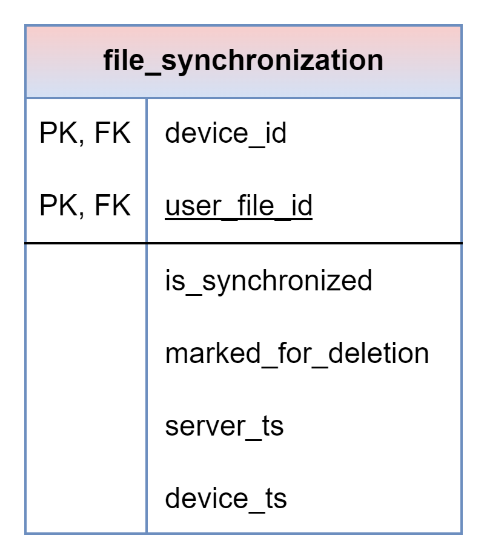

# About

This page describes the public.file_synchronization table

## Structure definition

| Column | Type | Constraints | Description |
| - | - | - | - |
| device_id | UUID | PK,  FK to public.devices(id) |
| user_file_id | UUID | PK,  FK to public.user_files(id) |
| is_synchronized | BOOLEAN | NOT NULL, DEFAULT FALSE |
| server_ts | TIMESTAMPTZ | NOT NULL, DEFAULT CURRENT_TIMESTAMP |
| device_ts | TIMESTAMPTZ |