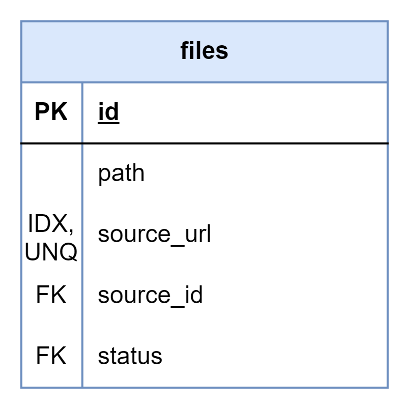

# About

This page describes the public.files table

## Structure definition

| Column | Type | Constraints | Description |
| - | - | - | - |
| id | BIGINT | PK, GENERATED ALWAYS AS IDENTITY |
| path | VARCHAR(255) | UNIQUE |
| uuid | UUID | NOT NULL, DEFAULT gen_random_uuid() |
| source_url | VARCHAR(255) | NOT NULL, UNIQUE, IDX |
| source | INT | NOT NULL,  FK to public.sources(id) |
| status | VARCHAR(2) | NOT NULL,  FK to public.file_statuses(status) |
| added_ts | TIMESTAMPTZ | NOT NULL, DEFAULT CURRENT_TIMESTAMP |
