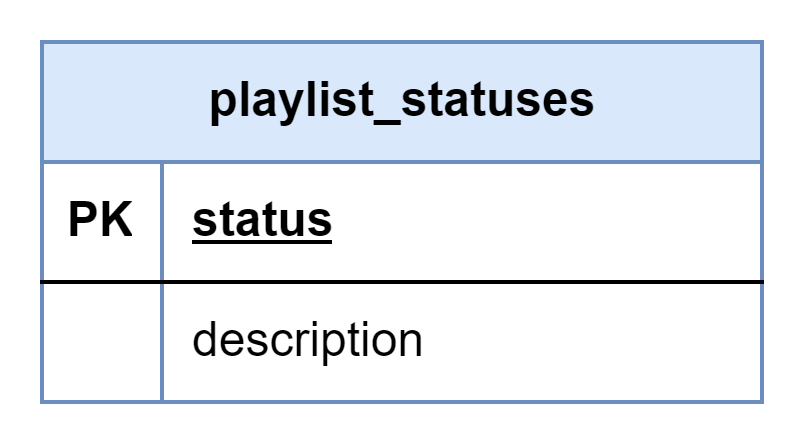

# About  

This page describes the public.playlist_statuses table  

## Structure definition  

| Column | Type | Constraints | Description |
| - | - | - | - |
| status  | VARCHAR(2) | PK |
| description  | VARCHAR(255) | NOT NULL |

## Data definition 

| status | description |
| - | - |
| 'СR'  | 'Created' |
| 'S'  | 'Synchronized' |
| 'E'  | 'Error' |
