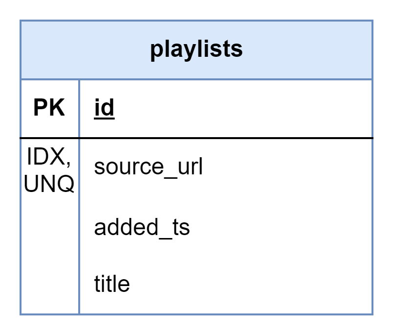

# About

This page describes the public.playlists table

## Structure definition

| Column | Type | Constraints | Description |
| - | - | - | - |
| id | BIGINT | PK, GENERATED ALWAYS AS IDENTITY |
| source_url | VARCHAR(255) | UNIQUE, IDX |
| source_id | INT | NOT NULL,  FK to public.sources(id) 
| added_ts | TIMESTAMPTZ | NOT NULL, DEFAULT CURRENT_TIMESTAMP |
| status | VARCHAR(2) | NOT NULL,  FK to public.playlist_statuses(status) |
| synchronization_ts | TIMESTAMPTZ | NULL |
| title | VARCHAR(255) | NOT NULL |

## Data definition 

| source_url | source_id | added_ts | title
| - | - | - | - |
| NULL | 'custom' source id | NOW() | Default |
