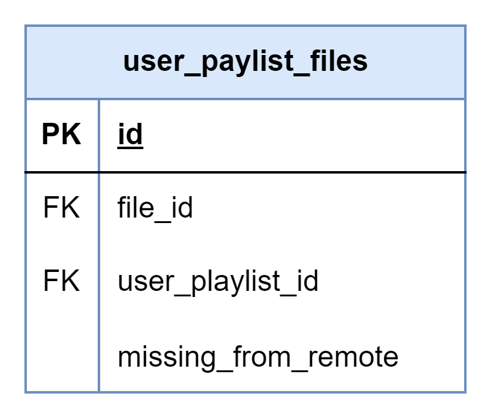

# About

This page describes the public.user_playlists table

## Structure definition

| Column | Type | Constraints | Description |
| - | - | - | - |
| id | BIGINT | PK, GENERATED ALWAYS AS IDENTITY |
| file_id | BIGINT | NOT NULL,  FK to public.files(id) |
| user_playlist_id | BIGINT | NOT NULL,  FK to public.playlists(id) |
| missing_from_remote | BOOLEAN | NOT NULL, DEFAULT FALSE |