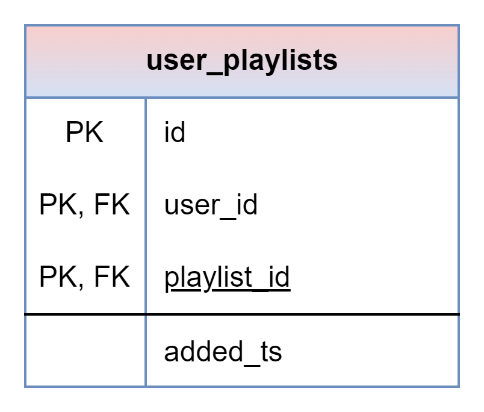

# About

This page describes the public.user_playlists table

## Structure definition

| Column | Type | Constraints | Description |
| - | - | - | - |
| id | BIGINT | PK, GENERATED ALWAYS AS IDENTITY |
| user_id | BIGINT | NOT NULL,  FK to public.users(id) |
| playlist_id | BIGINT | NOT NULL,  FK to public.playlists(id) |
| added_ts | TIMESTAMPTZ | NOT NULL, DEFAULT CURRENT_TIMESTAMP |