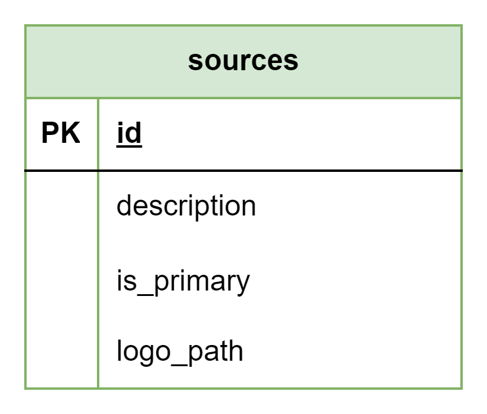

# About

This page describes the public.sources table

## Structure definition

| Column | Type | Constraints | Description |
| - | - | - | - |
| id | SERIAL | PK |
| description | VARCHAR(255) | NOT NULL |
| is_primary | BOOLEAN | NOT NULL |
| logo_path | VARCHAR(255) | NOT NULL |
