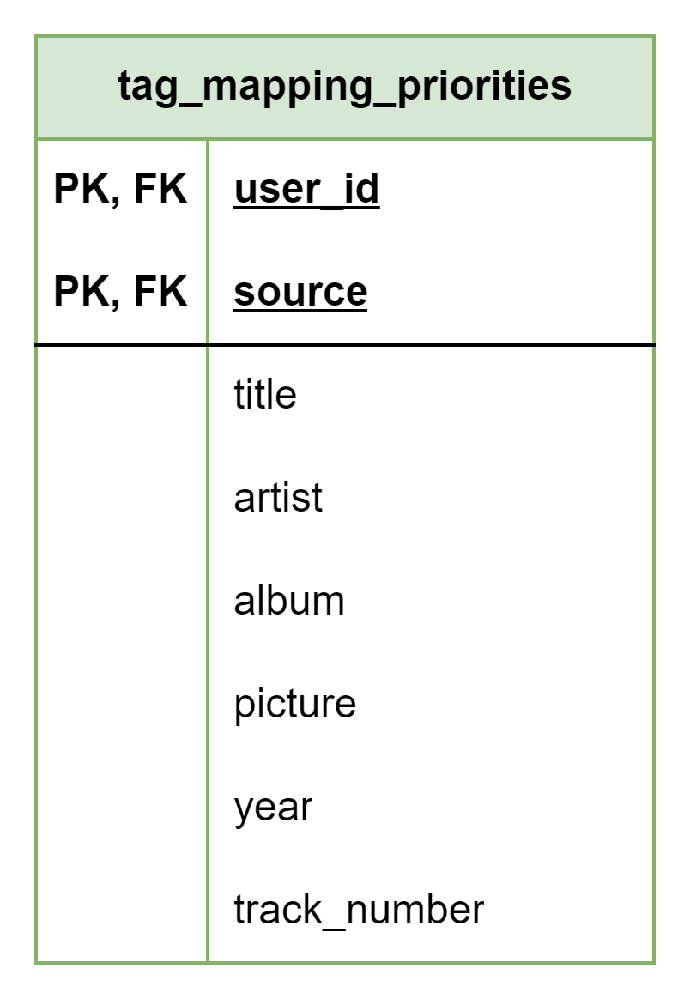

# About

This page describes the public.tag_mapping_priorities table

## Structure definition

| Column | Type | Constraints | Description |
| - | - | - | - |
| user_id | INT | PK,  FK to public.users(id) |
| source | INT | NOT NULL,  FK to public.sources(id) |
| title | SMALLINT | NOT NULL |
| artist | SMALLINT | NOT NULL |
| album | SMALLINT | NOT NULL |
| picture | SMALLINT | NOT NULL |
| year | SMALLINT | NOT NULL |
| track_number | SMALLINT | NOT NULL |
