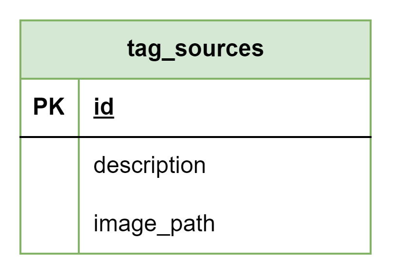

# About  

This page describes the public.tag_sources table  

## Structure definition  

| Column | Type | Constraints | Description |
| - | - | - | - |
| id | SERIAL | PK |
| description | VARCHAR(255) | NOT NULL |
| logo_path | VARCHAR(255) | NOT NULL, UNIQUE |

## Data definition 

| id | description | logo_path |
| - | - | - |
| 1 | 'Native' | TBD |