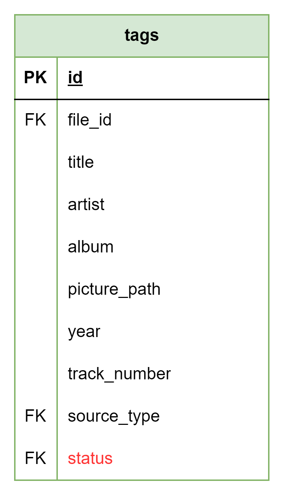

# About

This page describes the public.tags table

## Structure definition

| Column | Type | Constraints | Description |
| - | - | - | - |
| id | SERIAL | PK |
| file_id | INT | NOT NULL,  FK to public.files(id) |
| title | VARCHAR(255) |
| artist | VARCHAR(255) |
| album | VARCHAR(255) |
| picture_path | VARCHAR(255) |
| year | SMALLINT |
| track_number | INT |
| source | INT | NOT NULL,  FK to public.sources(id) |
| status | VARCHAR(2) | NOT NULL,  FK to public.tag_statuses(status) |