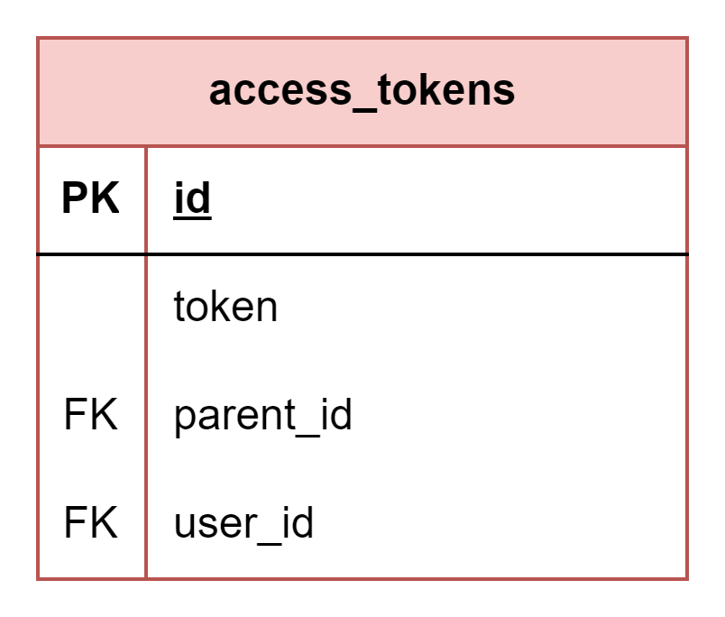

# About  

This page describes the public.access_tokens table  

  

# Structure definition  

| Column | Type | Constraints | Description |
| - | - | - | - |
| id  | SERIAL | PK |
| token | VARCHAR(255) | NOT NULL |
| parent_id | SERIAL | NOT NULL, UNIQUE,  FK to public.refresh_tokens(id) |
| user_id  | INTEGER | NOT NULL,  FK to public.users(id) |