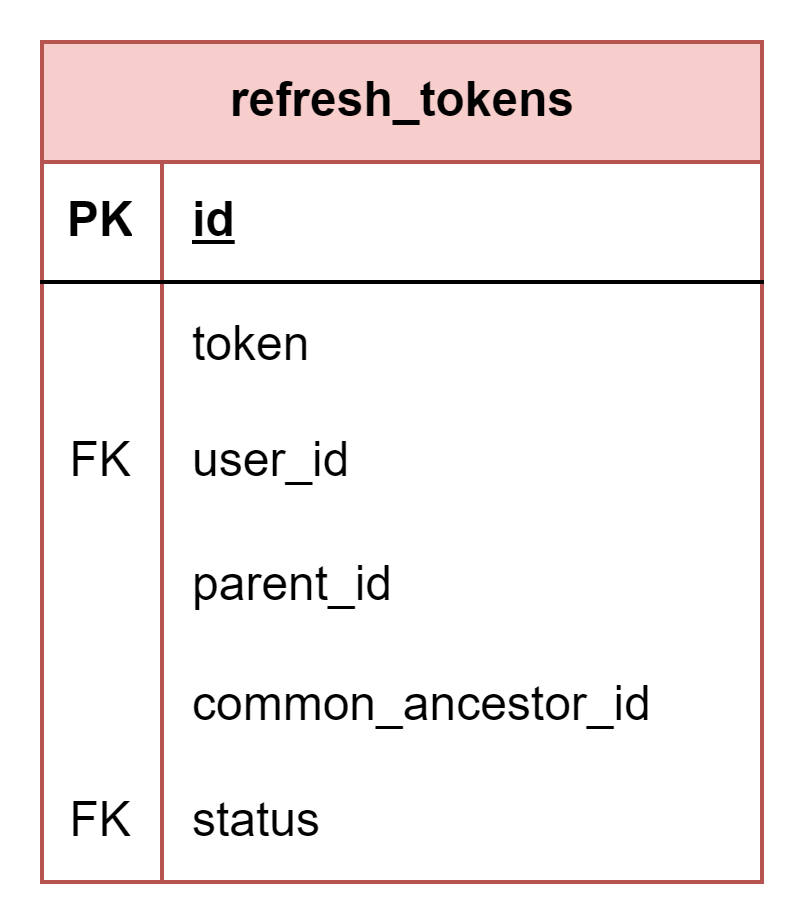

# About  

This page describes the public.refresh_tokens table  

## Structure definition  

| Column | Type | Constraints | Description |
| - | - | - | - |
| id  | SERIAL | PK |
| token | VARCHAR(255) | NOT NULL |
| user_id  | INTEGER | NOT NULL,  FK to public.users(id) |
| parent_id | BIGINT | NOT NULL, UNIQUE |
| common_ancestor_id | BIGINT |
| status | VARCHAR(255) | NOT NULL,  FK to public.token_statuses(status) |

