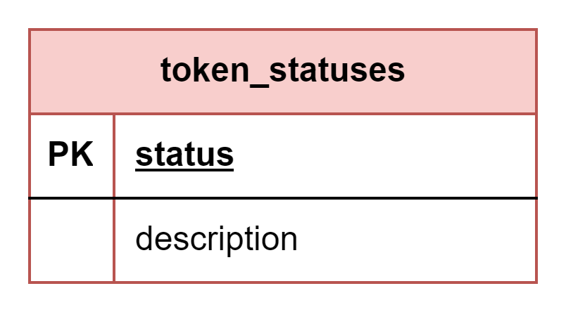

# About  

This page describes the public.token_statuses table  

## Structure definition  

| Column | Type | Constraints | Description |
| - | - | - | - |
| status  | CHAR(1) | PK |
| description  | VARCHAR(50) | NOT NULL |

## Data definition 

| status | description |
| - | - |
| 'A'  | 'Active' |
| 'I'  | 'Inactive' |