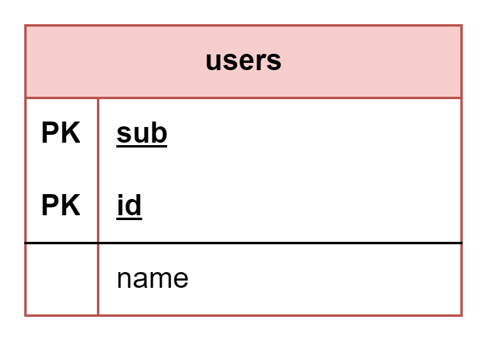

# About  

This page describes the public.users table  

  

## Structure definition  

| Column | Type | Constraints | Description |
| - | - | - | - |
| id  | SERIAL | PK |
| name | VARCHAR(255) | NOT NULL |
| password | VARCHAR(255) | NOT NULL |

